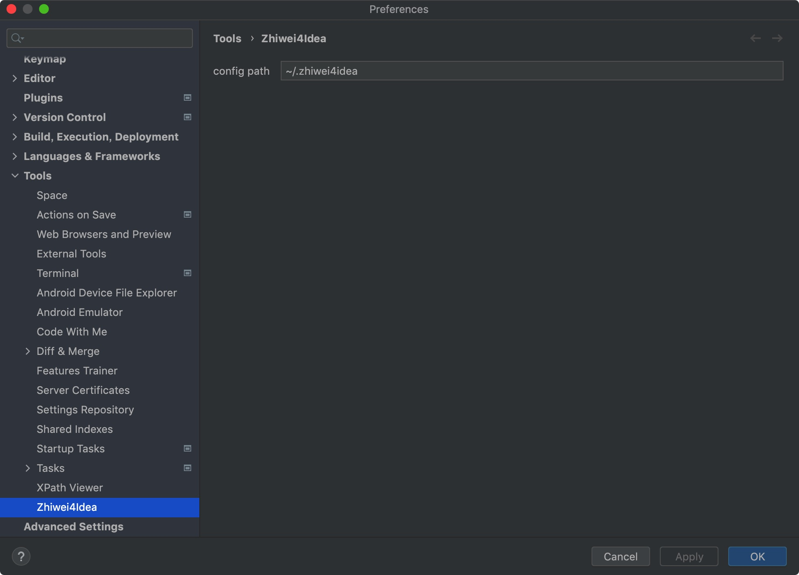
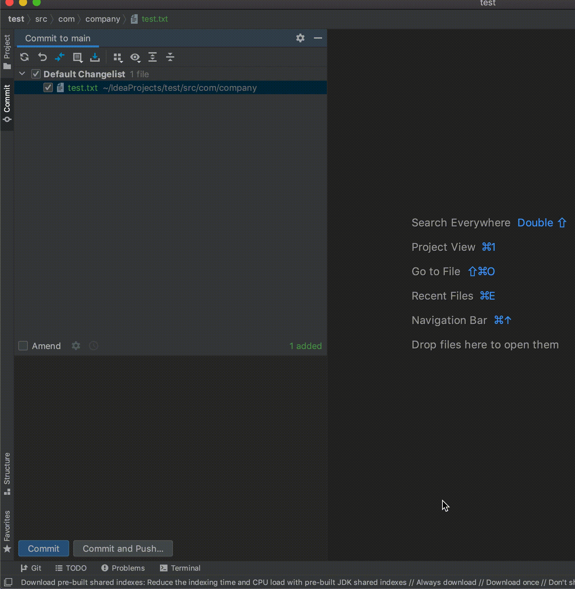

# Plugin For Zhiwei

为了在集成开发环境中快速地使用知微的相关功能，不用频繁的切换应用程序，而开发了这个插件项目

## 功能

- [x] commit message 卡片搜索
- [x] 使用 JCEF 打开知微相关视图
- [x] commit message 支持移动「缺陷卡」到「解决验证」状态
- [ ] 艾特飞书小伙伴

## 使用方法

安装本插件和准备一份配置文件(YAML)  
一、假设配置文件路径为 ~/.zhiwei4idea，需要填写环境以及对应的用户名和密码

```yaml
# location at ~/.zhiwei4idea

tkb:
  domain: https://tkb.agilean.cn
  username: abc@agilean.cn
  password: tset
dev:
  domain: http://test.agilean.cn
  username: abc@agilean.cn
  password: test

```

二、进入插件配置 Preferences->Tools->Zhiwei4idea 填写对应的配置文件地址和知微域名



## 功能介绍

### commit message 卡片搜索

知微提交代码规范中，需要在提交信息中包含用户故事或者缺陷等相关卡片的编号  
在 commit dialog 面板上，暂存修改部分，然后在 message 的输入过程中，可以  
输入触发前缀「card::」键入搜索关键字，即可搜索  
该功能移植知微评论区井号搜索功能



### zhiwei viewer 知微工具窗

内嵌一个 JCEF 装载知微工具，便捷看卡片/挪卡片/评论卡片等操作


### 移动卡片至解决验证

在 commit dialogue 中，通过输入 `@ag:${keyword} #${code}` 关键字(*内置了内容补全*)可以启动移动卡片任务。
该任务具体内容是：将卡片从「缺陷看板」的「发现」「优先」或者「修复中」移动至「解决验证」。  
目的是增加修复缺陷挪动卡片通知测试的验证的便利性。  
可用的关键字有：

- close / closes / closed
- fix / fixes / fixed
- resolve / resolves / resolved

### Action

- Reload Zhiwei Viewer 重新使用配置文件中的用户名和密码进行登录并且重新刷新知微工具窗
- Search Id in Zhiwei 在某个环境中搜索某个实体ID所对应的信息 快捷键(shift+command+i)

